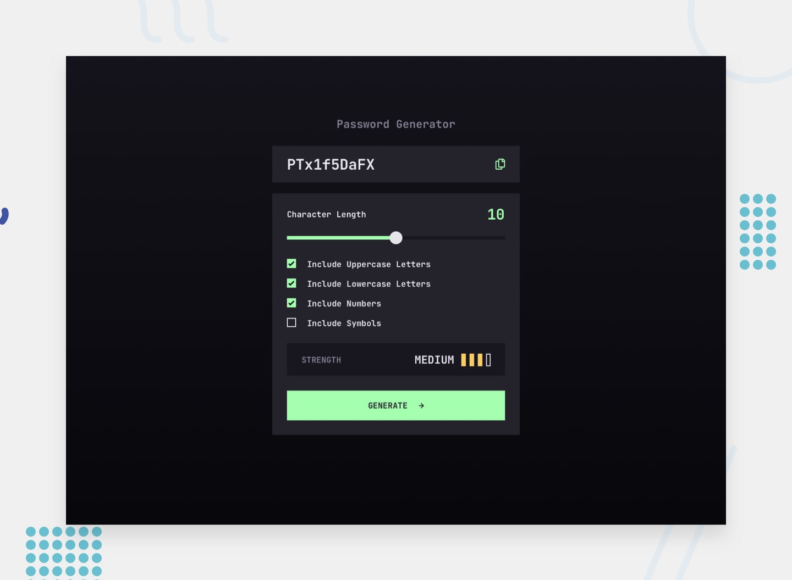

# Frontend Mentor - Password generator app solution

This is a solution to the [Password generator app challenge on Frontend Mentor](https://www.frontendmentor.io/challenges/password-generator-app-Mr8CLycqjh). Frontend Mentor challenges help you improve your coding skills by building realistic projects.

## Table of contents

- [Overview](#overview)
  - [The challenge](#the-challenge)
  - [Screenshot](#screenshot)
  - [Links](#links)
- [My process](#my-process)
  - [Built with](#built-with)
  - [What I learned](#what-i-learned)
  - [Continued development](#continued-development)
  - [Useful resources](#useful-resources)
- [Author](#author)

## Overview

### The challenge

Users can:

- Generate a password based on the selected inclusion options (uppercase, lowercase, numbers, symbols)
- Choose a character length between 0 and 20 with a custom-styled range slider
- Copy the generated password to their clipboard with one click, with a "COPIED" confirmation
- See a live strength rating (Too Weak, Weak, Medium, Strong) represented by colored bars
- Experience a responsive layout that adapts from mobile to desktop
- See hover and focus states on every interactive element

### Screenshot



### Links

- Solution URL: [Solutions on the frontend](https://www.frontendmentor.io/profile/AristarhMD)
- Live Site URL: [Deployed site](https://password-generator-vn.netlify.app)
- GitHub URL: [GitHub Project](https://github.com/AristarhMD/password-generator-app.git)

## My process

### Built with

- Semantic HTML5 markup
- [React 19](https://react.dev/) - UI library, built with function components and hooks (`useState`)
- [Vite](https://vitejs.dev/) - dev server and build tool
- [Tailwind CSS v4](https://tailwindcss.com/) - utility-first styling with custom design tokens (colors, type presets)
- Flexbox & CSS Grid
- Mobile-first workflow
- Clipboard API (`navigator.clipboard.writeText`) for the copy-to-clipboard feature

### What I learned

**Coloring the range slider track dynamically.** Native `<input type="range">` doesn't expose the "filled" portion of the track as a separate element, so I calculated the fill percentage from the current value and painted it with an inline `linear-gradient`:

```jsx
const min = 0;
const max = 20;
const percentage = ((formData.charNum - min) / (max - min)) * 100;

<input
  type="range"
  style={{
    background: `linear-gradient(to right, #A4FFAF 0%, #A4FFAF ${percentage}%, #18171f ${percentage}%, #18171f 100%)`,
  }}
  ...
/>
```

**Swapping the slider thumb style while dragging.** I tracked a small `isDragging` boolean (set on mouse/touch down and up) so I could toggle Tailwind's pseudo-element arbitrary variants and give the thumb a different fill and border color while the user is actively dragging it:

```jsx
className={`range ${
  isDragging
    ? "[&::-webkit-slider-thumb]:bg-grey-850 [&::-webkit-slider-thumb]:border-green-200"
    : "[&::-webkit-slider-thumb]:bg-white [&::-webkit-slider-thumb]:border-transparent"
}`}
```

**Building a password strength meter.** Rather than scoring based on character variety, I kept it simple and mapped password _length_ to four tiers, each with its own label, color, and number of filled bars:

```jsx
const getStrength = (length) => {
  if (length >= 16) return { level: 4, color: "strong", label: "STRONG" };
  if (length >= 11) return { level: 3, color: "medium", label: "MEDIUM" };
  if (length >= 6) return { level: 2, color: "weak", label: "WEAK" };
  if (length >= 1) return { level: 1, color: "very-weak", label: "TOO WEAK!" };
  return { level: 0, color: "", label: "" };
};
```

**Copy-to-clipboard with timed feedback.** Using the async Clipboard API, I show a "COPIED" message for 5 seconds after a successful copy, and reset it whenever a new password is generated:

```jsx
const handleCopy = async () => {
  await navigator.clipboard.writeText(password);
  setIsCopied(true);
  setTimeout(() => setIsCopied(false), 5000);
};
```

### Continued development

- Guarantee that at least one character from each _selected_ type (uppercase, lowercase, number, symbol) actually appears in the generated password, instead of leaving it to chance
- Disable the "Generate" button (or show a validation message) when no character type is selected
- Persist the user's last-used settings (length + checkbox choices) with `localStorage`
- Add keyboard support for adjusting the slider and a visible focus ring that matches the design more closely
- Write unit tests for the generation and strength-scoring logic

### Useful resources

- [MDN - Clipboard API](https://developer.mozilla.org/en-US/docs/Web/API/Clipboard_API) - reference for `navigator.clipboard.writeText` and handling the copy permission/promise correctly.
- [Tailwind CSS v4 docs](https://tailwindcss.com/docs) - useful for the new CSS-first `@theme` configuration and arbitrary variant syntax used for the slider thumb states.
- [CSS-Tricks - Styling Cross-Browser Compatible Range Inputs](https://css-tricks.com/styling-cross-browser-compatible-range-inputs-css/) - helped with getting the `::-webkit-slider-thumb` / `::-moz-range-thumb` styles to behave consistently.

## Author

- GitHub - [Victor Nani](https://github.com/AristarhMD)
- Frontend Mentor - [@Victor Nani](https://www.frontendmentor.io/profile/AristarhMD)
- LinkedIn - [@Victor Nani](https://www.linkedin.com/in/victor-nani-4b7a13179/)
